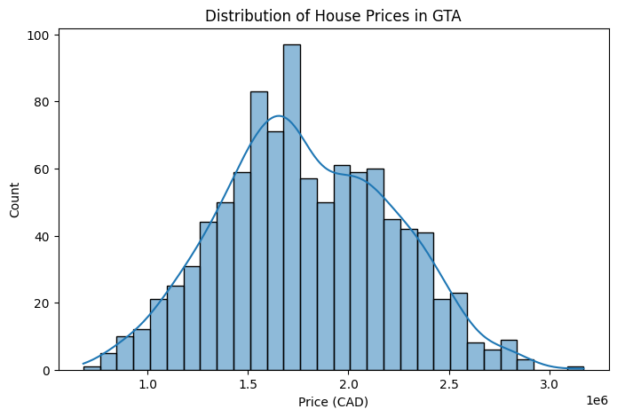
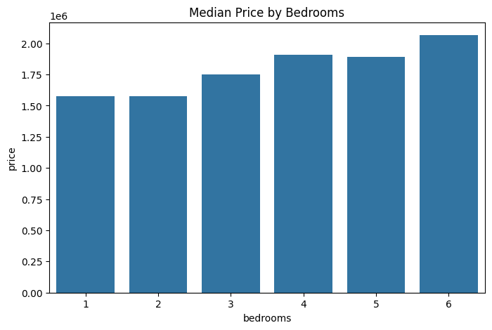
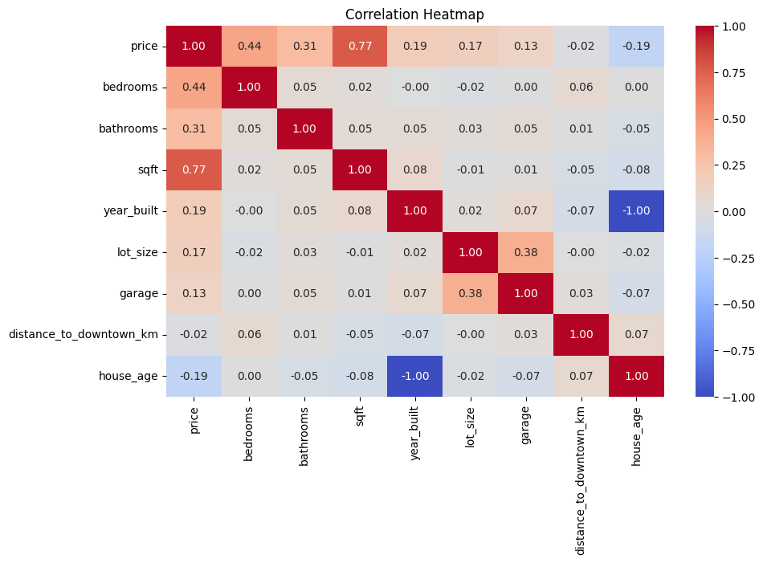

# GTA Housing Price Prediction Project
This project demonstrates a machine learning pipeline for predicting housing prices in the Greater Toronto Area (GTA) using an auto-generated dataset. The workflow includes data cleaning, exploratory data analysis (EDA), model training and prediction. 

## Project Structure
```
project/
│── gta_housing_synthetic.csv # raw dataset (auto-generated)
│── data_cleaning.ipynb # notebook for cleaning + feature engineering
│── gta_housing_clean.csv # cleaned dataset (output of cleaning)
│── gta_housing_analysis.ipynb # notebook for EDA + modeling
│── README.md # project overview
```
## Exploratory Data Analysis
### Distribution of House Prices


This histogram shows how the house prices are right-skewed, meaning most homes cluster at the lower-to-mid price range while the expensive ones are tailed towards right. This is typically how the real estate market works where more affordable homes are common and luxury homes are rare and at a higher price. 

### Price vs Bedrooms 


When prices are compared to the number of bedrooms, there is a positive trend -> More bedrooms, higher price. However, this is not perfectly linear as a 5-bedroom home isn't always worth muh more than a 4-bedroom. 

### Correlation Heatmap


This heatmap shows that there is a strong correlation between ```sqft``` and ```price```. Additionaly, bedrooms and bathrooms are correlated with price, but less strongly than square footage. Other features (ie. garage, years built and distance to downtown) have weaker or mixed correlations - not dominant drives of price). 

## Models
### Linear Regression
A supervised machine learning model algorithm to predict a continuous target variable based on one or more independent variables by fitting the best straight line (line of best fit) to the data. The line showcases the minimum difference (error) between the predicted and actual values. 
#### When training the model:
  **Features (X)** -> All columns *except* price ```(Bedrooms, Bathrooms, Sqft, House Type, Year Built, Neighbourhood, Lot Size, Garage, Distance, House Age)``` 
  
  **Target (y)** -> the ```Price``` column 

  During prediction, all the rows, except the price column, are fed into the model. The categorical variables (```House Type, Neighbourhood```) get one-hot encoded. Additionally, each feature value is multiplied by its learned coefficient and then added to the intercept.
### Random Forest Regression
An ensemble learning method used in machine learning for predicting continuous numerical values. It utilizes multiple decision trees during training and then calculates the average of each individual's predictions to produce a more robust final prediction.
#### When training the model:
You train 100 decision trees and each tree is trained on a random subset of data and features. The trees then split the data based on rules that best separate price ranges. 

During prediction, for each house, every tree makes a prediction and then calculates the average of them to produce the final prediction. Additionally, Random Forest can also tell which features are the most important for predicting price.
```python
import pandas as pd

importances = pd.Series(rf_model.feature_importances_, index=X_train.columns)
print(importances.sort_values(ascending=False))
```

## Evaluation
In order to evaluate both models, RMSE, MAE and R² were computed. 

RMSE: Average size of errors

MAE: Average absolute error 

R²: How well the model explains the variation in prices

**Comparison Between Models:**
|Metric | Linear Regression | Random Forest |
|---|---|---|
| RMSE | 111,938 | 142,701 |
| MAE | 91,481 | 110,361 |
| R² | 0.939 | 110,361 |

According to the results, Linear Regression performed better than Random Forest on this data as it has lower errors and higher R².


## Feature Importance (Random Forest)

As mentioned earlier, Random Forest has the ability to tell which features are the most important for predicting the price". 


According to this model, the most important feature is ```sqft``` followed by ```bedrooms```, ```bathrooms```, and ```lot_size```. 
